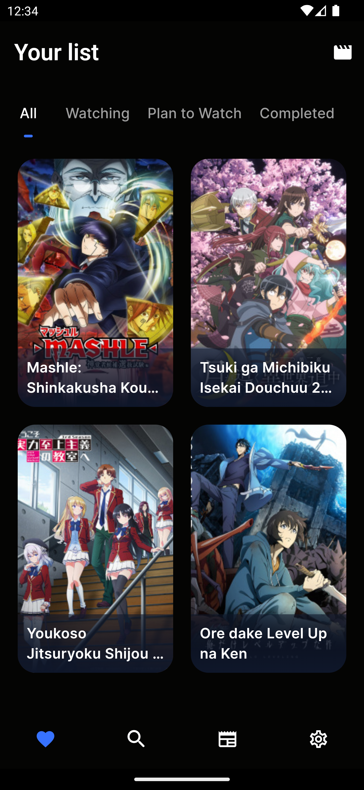
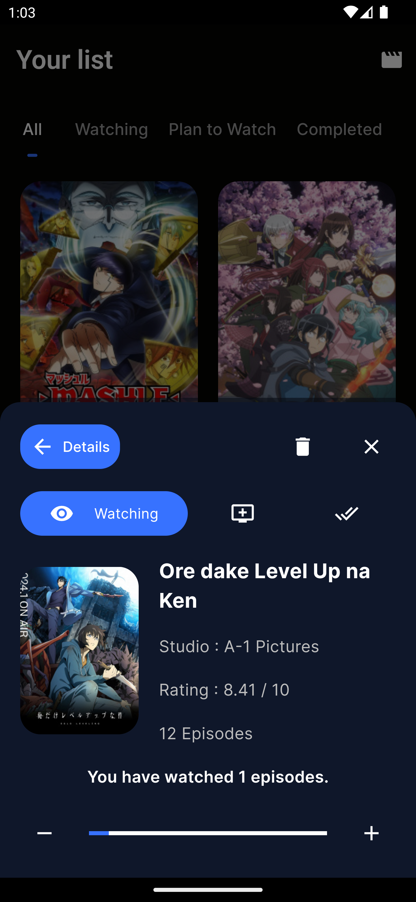
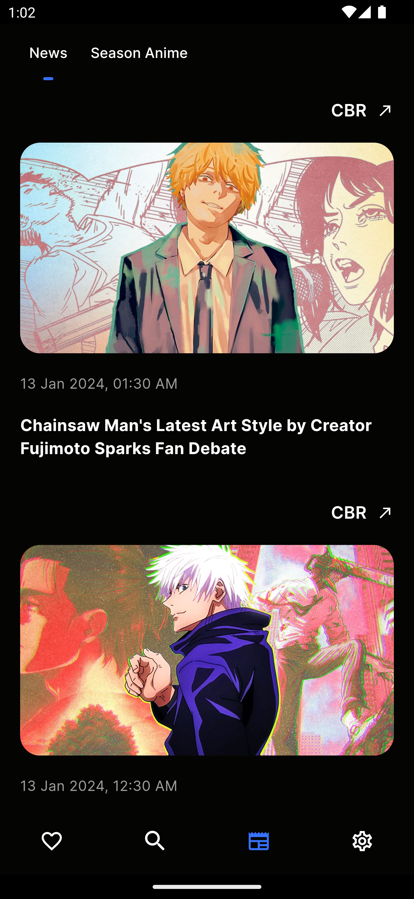
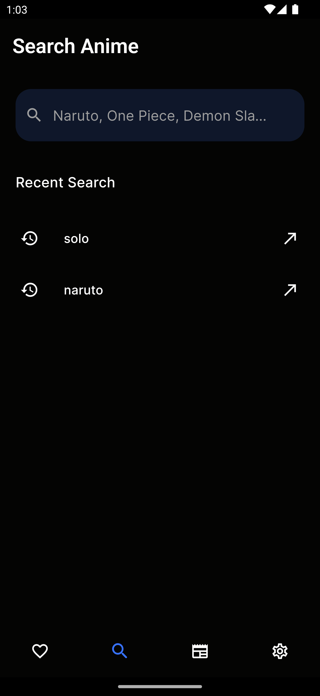
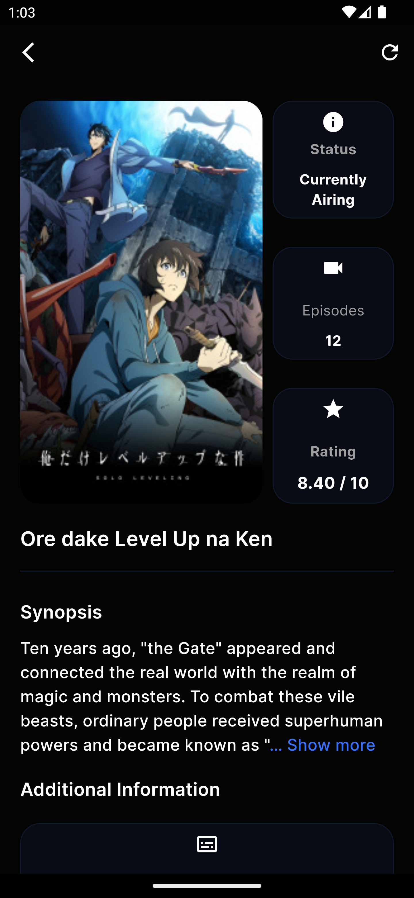

# anima

_Keep track of anime you have watch and get latest news update and more_

## Screenshots

    

        
        
        
        
        
    

## Feature

- Episode Tracking:
  - Monitor the number of episodes watched for each anime series.
  - Mark episodes as watched, providing a visual progress indicator.

* Latest News Updates:

  - Keep users informed about the latest developments in the anime world.

* Search Functionality:

  - Quick and efficient search feature for finding information about specific anime series.
  - Include filters and sorting options to enhance search precision.

* Seasonal Anime Tracking:
  - Provide information on currently airing seasonal anime.
  - Enable users to track and discover new anime series as they are released.

If you want to have any feature than make sure to tell me. I would be happy to add it to the app on the next version of it.

## Download app

_There are three variant of apk choose according to your device most device support arm64-v8 variant_

Download from [github](https://github.com/devyuji/anima/releases/latest)

## Reporting Bugs

If you encounter any bugs or issues while using our app, we encourage you to report them. To do so, please follow these steps:

1. Check the [existing issues](https://github.com/devyuji/anima/issues) to see if the bug has already been reported. If you find a similar issue, you can add additional information or provide your experience.

2. If your issue is not already reported, [create a new issue](https://github.com/devyuji/anima/issues/new/choose) by following the issue template. Please provide as much detail as possible, including a clear title, a description of the bug, steps to reproduce it, and any relevant logs or error messages.

3. Be sure to include the version of the app and the device/OS you're using. Screenshots and code examples are also helpful.

Thank you for helping us improve our app!
